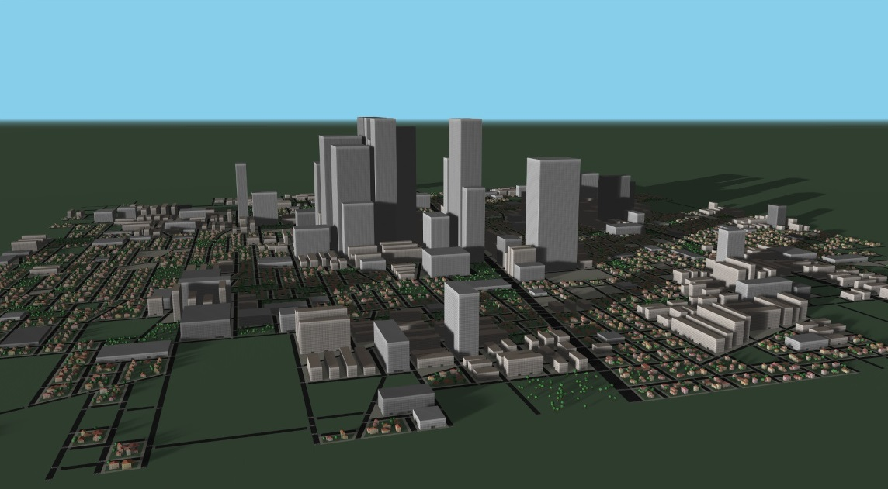

# COVID-19-SIM

I started to build a COVID-19 simulator from scratch. Simulation is based on a reasonably detailed social behaviour. I track my decision path [here](https://twitter.com/PavelBoytchev).

The simulator is still not ready for a general use &ndash; it is still under heavy development. However, you can try the [Simulator](https://boytchev.github.io/COVID-19-SIM/covid-19-simulator.html). The simulation is controlled by over 130 parameters. The [Configurator](https://boytchev.github.io/COVID-19-SIM/covid-19-configurator.html) is used to inspect and update these parameters.

 
### Publications
* Boytchev P., Boytcheva S. (2021) **Visual Educational Simulator of Pandemic: Work in Progress**. In: Lopata A., Gudonienė D., Butkienė R. (eds) Information and Software Technologies. ICIST 2021. Communications in Computer and Information Science, vol 1486. Springer, Cham. DOI: [10.1007/978-3-030-88304-1_26](https://doi.org/10.1007/978-3-030-88304-1_26), URL: [rdcu.be/czkc0](https://rdcu.be/czkc0), ISBN: 978-3-030-88303-4, SJR: 0.16 (2020, Q4, Computer Science (miscellaneous))
* Boytchev P., Boytcheva S. (2021) **Shader Injection for Instanced 3D Models**, In: Proceedings of the International IEEE Conference "Automatics and Informatics 2021" (ICAI'21)] (in print).

 
### Presentations
* **Visual Educational Simulator of Pandemic: Work in Progress**, presented at the [International Conference on Information and Software Technologies (ICIST 2021)](https://icist.ktu.edu/), session 6: Information Technology Applications, special session on Smart e-Learning Technologies and Applications, Kaunas, Lithuania, 14/10/2021 - 16/10/2021
* **Shader Injection for Instanced 3D Models**, presented at the [International IEEE Conference "Automatics and Informatics 2021" (ICAI'21)](http://icai-conf.org/), track B, session B1 "Computer Science", 30.09.2021, Varna, Bulgaria, 30.09-1.10.2021.

	
November, 2021
 
